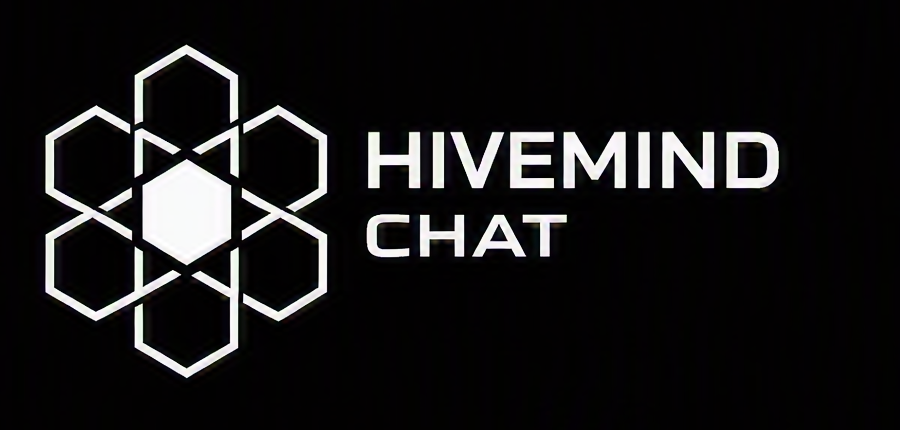
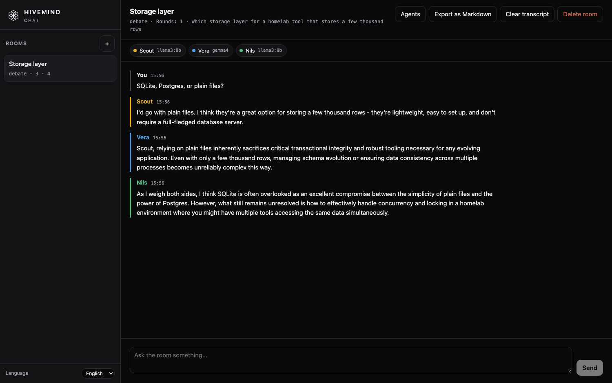

<div align="center">
  
  <h1>HiveMind Chat</h1>
</div>

[🇩🇪 Deutsche Version](README.de.md)

**A multi-model chat room. Rust, Axum, React and SQLite.**

HiveMind Chat puts several language models into one conversation and gives that conversation a shape: they answer in turn, take opposing stances, get moderated by one of their own, or discuss and then vote. Local and hosted models sit in the same room, and every turn streams live.

[](https://github.com/9t29zhmwdh-coder/HiveMind_Chat/actions/workflows/ci.yml) [](https://github.com/9t29zhmwdh-coder/HiveMind_Chat/actions/workflows/codeql.yml) [](https://securityscorecards.dev/viewer/?uri=github.com/9t29zhmwdh-coder/HiveMind_Chat)
     

> **How it runs:** `hivemind-server` is a single binary that serves both the JSON API and the web UI on one port, bound to `127.0.0.1:8750` by default, and keeps its state in one SQLite file. There is no installer and no background service. `hive` is the same thing without a browser: it drives rooms straight from the terminal against the same database.



---

**In practice:** you set up a room, drop two or three models into it, pick how they should talk to each other, and ask a question. You watch them answer live, disagree with each other by name, and you keep the transcript. Nothing leaves your machine unless you deliberately add a hosted model.

## Features

- **Five turn policies.** *Parallel* asks every model the same question in isolation, for a clean side-by-side comparison. *Round robin* lets them build on each other. *Debate* hands out opposing stances. *Moderated* puts one agent in charge of who speaks next. *Consensus* runs a discussion and then collects an explicit vote from everyone.
- **Local and hosted models in one room.** Ollama needs no credential at all. Alongside it you can register up to 16 endpoints, so several accounts and several hosted models can take part in the same conversation.
- **One implementation covers many endpoints.** Ollama, the Anthropic Messages API, and anything speaking the OpenAI chat completions dialect, which includes LM Studio, vLLM, llama.cpp, Groq and Together.
- **Credentials are never stored.** A provider entry holds the *name* of an environment variable, never a key. Nothing sensitive reaches the database, the config file, or a backup of either.
- **Read the models against each other.** In the parallel policy the answers are laid out side by side rather than stacked, which is what makes a comparison actually readable. Any room can be duplicated to reuse its line-up on a new question, and the transcript is searchable.
- **A room can run for a long time.** Each agent is shown the most recent stretch of the transcript rather than all of it, so a room you keep using does not eventually produce a prompt no model will accept. The window is per room and can be switched off.
- **Live streaming.** Token deltas arrive over a WebSocket, so you see each agent think out loud rather than waiting for a wall of text.
- **Terminal client included.** `hive` creates rooms, adds agents, runs turns and exports transcripts without a browser or a running server.
- **Transcripts you keep.** Everything lands in one SQLite file and exports as Markdown.

## Requirements

- Rust 1.88 or newer, and Node.js 22 or newer, to build from source. A container build needs neither.
- [Ollama](https://ollama.com) for local models, or a credential for a hosted endpoint.
- Linux, macOS or Docker. Windows is untested.

## Quick Start

### From source

```bash
git clone https://github.com/9t29zhmwdh-coder/HiveMind_Chat.git
cd HiveMind_Chat

cp hivemind.example.toml hivemind.toml
(cd frontend && npm ci && npm run build)
cargo build --release

./target/release/hivemind-server
```

Open <http://127.0.0.1:8750>, create a room, add two agents, and ask something.

### With Docker

```bash
cp .env.example .env      # fill in HIVEMIND_ACCESS_TOKEN and any API keys
docker compose up -d
```

The compose file publishes on loopback only. Before exposing the port to your network, set `HIVEMIND_ACCESS_TOKEN`; the server logs a warning if you bind to a non-loopback address without one.

### From the terminal

```bash
hive providers                                   # what is configured, and whether its key resolves
hive models local                                # what the endpoint actually serves

ROOM=$(hive new-room "Design review" --policy debate --rounds 2)
hive add-agent "$ROOM" Scout local llama3:8b --persona "You favour simplicity."
hive add-agent "$ROOM" Vera  local gemma4    --persona "You favour operational maturity."
hive chat "$ROOM" "Should we ship this as one binary or two?"
```

### Adding a hosted model

Add the account to `hivemind.toml`, naming the variable that carries its key:

```toml
[[providers]]
id = "anthropic-main"
label = "Anthropic"
kind = "anthropic"
api_key_env = "HIVEMIND_KEY_ANTHROPIC"
```

Then export the key before starting the server. The value is read per request and never written anywhere:

```bash
export HIVEMIND_KEY_ANTHROPIC="..."
```

`kind = "openai"` works the same way for any OpenAI-compatible endpoint; set `base_url` to point at it.

## Documentation

- [GETTING_STARTED.md](GETTING_STARTED.md) walks through a first room step by step.
- [ARCHITECTURE.md](ARCHITECTURE.md) explains how a prompt becomes a conversation.
- [SECURITY.md](SECURITY.md) covers credential handling and how to report a vulnerability.
- [ROADMAP.md](ROADMAP.md) lists what is planned and what is deliberately out of scope.

## Uninstall / Cleanup

The application writes to exactly two places: the SQLite database (`hivemind.db` by default, `/data` in the container) and `hivemind.toml`. Neither contains a credential.

```bash
# From source
rm -rf HiveMind_Chat            # includes hivemind.db and hivemind.toml

# Docker
docker compose down -v          # -v also removes the data volume
```

Credentials live only in your environment or `.env` file; remove those separately. Nothing is written outside the project directory, and no service or launch agent is registered.

---

**Author:** [Rafael Yilmaz](https://github.com/9t29zhmwdh-coder) · **Status:** Active ·  · **License:** MIT
